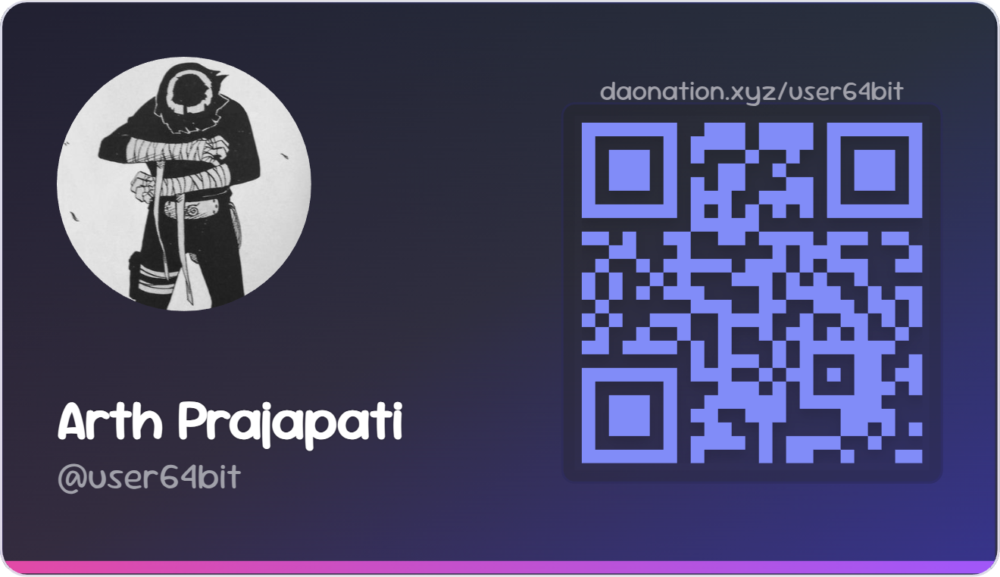

  

<h1 align="center">🛠️ POW</h1>

---

| Project        | Description | Tech Stack | Live Demo | Repo |
|----------------|-------------|------------|-----------|------|
| **Wallet-GPT** | AI-powered wallet that executes crypto commands like “send 0.1 SOL” | Next.js, OpenAI, Solana, TS, Tailwind | [wallet-gpt](https://wallet-gpt.arthprajapati.com) | [GitHub](https://github.com/user-64bit/wallet-gpt) |
| **PollChain** | Fully decentralized voting system on Solana | Rust, Solana, Next.js, TS, Tailwind | [pollchain](https://pollchain.arthprajapati.com) | [GitHub](https://github.com/user-64bit/poll-chain) |
| **DAOnation** | Web3 micro-payment platform for creators | Solana, Next.js, TS, Tailwind | [daonation.xyz](https://daonation.xyz) | [GitHub](https://github.com/user-64bit/DAOnation) |
| **Notebook** | Open-source Notion alternative with privacy focus | Convex, Next.js, TS, Tailwind | [notebook](https://notebook.arthprajapati.com) | [GitHub](https://github.com/user-64bit/notebook) |
| **Get Git** | GitHub activity explorer with fancy UI | GitHub API, Next.js | [get-git](https://get-git.arthprajapati.com) | [GitHub](https://github.com/user-64bit/Get-Git) |
| **Suchi** | Rust CLI for organizing thoughts and tasks | Rust | [crates.io](https://crates.io/crates/suchi) | [GitHub](https://github.com/user-64bit/suchi) |
| **CryptoCompass** | Multi-chain asset tracker | Next.js, TS, Tailwind | — | [GitHub](https://github.com/user-64bit/CryptoCompass) |
| **CodeRunner** | Minimal in-browser REPL for quick testing | React, Express, Tailwind | — | [GitHub](https://github.com/user-64bit/CodeRunner) |
| **Streamify** | Spotify-style music streaming experiment | Next.js, Tailwind | — | [GitHub](https://github.com/user-64bit/Streamify) |
| **Don’t Die Agent** | AI-powered health tracking inspired by longevity | Next.js, OpenAI, Tailwind | — | [GitHub](https://github.com/user-64bit/dd-agent) |

---

## 💰 Support

  

---

## 🔎 More?

> View all my PRs, reviews & open-source work on [Get Git](https://get-git-sigma.vercel.app/user-64bit)

